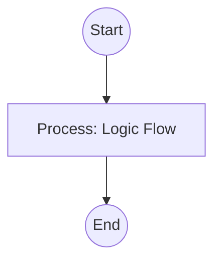

## Context
Analyzes a concept and recommends whether it should be a glossary entry or inlined.

# Provide Glossary Guidance

This skill enables Flynn to evaluate the "weight" of a concept and its long-term utility to the repository.

## Architecture

## [Heuristics](glossary/heuristics.glossary.md)

Flynn uses the following heuristics:
- **Reuse**: Is this term likely to be used in 3+ files or across different domains? (-> NEW_ENTRY)
- **Complexity**: Is the definition more than 2 sentences long? (-> NEW_ENTRY)
- **Ambiguity**: Is the term jargon that could be misinterpreted without a formal definition? (-> NEW_ENTRY)
- **Locality**: Is the concept specific only to one function or a single scratch file? (-> INLINE)

## Output Format

1. **Decision**: `NEW_ENTRY` | `INLINE`
2. **Rationale**: Why this choice was made based on the heuristics.
3. **Proposed Alias**: (Optional) If `INLINE`, suggested keywords for future search.

## Verification Protocol
1. Perform a manual dry-run of the execution steps.
2. Verify that the output matches the expected result defined in the Quality Gate.
