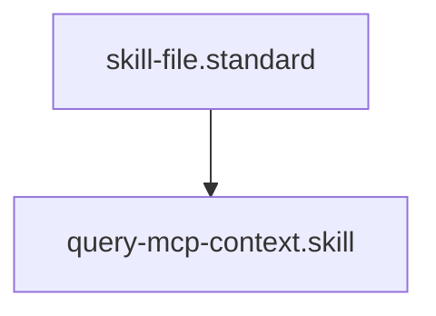

# MCP Context Bridge

## Context
Provides a standardized way for the AI Kernel to reach out to external data sources. This skill abstracts away the complexities of service-specific APIs by leveraging the MCP standard.

## Execution Steps
1. **Registry Lookup**: Use the `registry/` to find the correct `server_url`.
2. **Engine Invocation**: Run `mcp_query.py`.
3. **Synthesis**: Ingest the returned context into the current working session.

## Quality Gate
- **Verification**: Output must be a valid JSON result from the MCP tool.
- **Enforcement**: Mandatory skill for any cross-service context retrieval.

## Architecture

## Verification Protocol
1. Run `python3 drivers/mcp/mcp_query.py http://localhost:8080 list_tools`.
2. Verify output status is `success` or `error` (if server offline).
