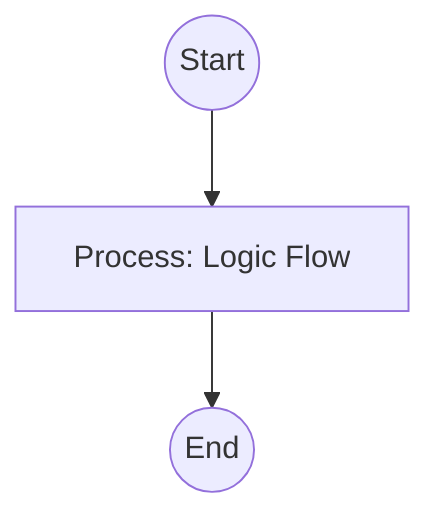

## Context
Analyzes industry best practices for a specific technical domain.

# Research Domain Patterns

This skill researches industry standards for a specified `domain`.

## Architecture

## Execution Steps

1. **Search**: Find high-authority sources for the domain.
2. **Extract**: Identify widely adopted "Preferred" practices.
3. **Identify Antipatterns**: Note common pitfalls and discourages practices.
4. **Report**: Summarize findings for the next step in the standard creation loop.

## Verification Protocol
1. Perform a manual dry-run of the execution steps.
2. Verify that the output matches the expected result defined in the Quality Gate.
