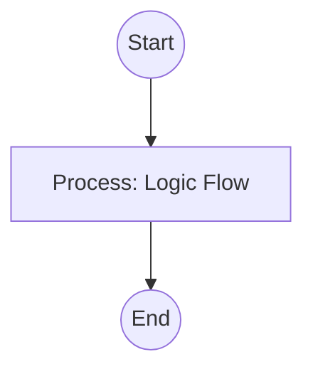

## Context
Saves curated information from the current conversation to the `context/` folder.

# Save Conversation Context

This skill ensures that important decisions and data survive across AI sessions.

## Architecture

## Execution Steps

1. **Format Content**: Ensure the `content` includes frontmatter with `type: context`.
2. **Path Selection**: Use the `context/` directory.
3. **Write**: Save the file using the `.context.md` extension.
4. **Link**: provide a link to the new context file.

## Verification Protocol
1. Perform a manual dry-run of the execution steps.
2. Verify that the output matches the expected result defined in the Quality Gate.

## Quality Gate

Context management is governed by the **[Kernel Standard](../standards/kernel.standard.md)**.
- **Verification**: Ensure the filename is descriptive and follows the `[topic].context.md` pattern.
- **Enforcement**: Context files must not contain redundant data already in the glossary; they should link to the glossary instead.
