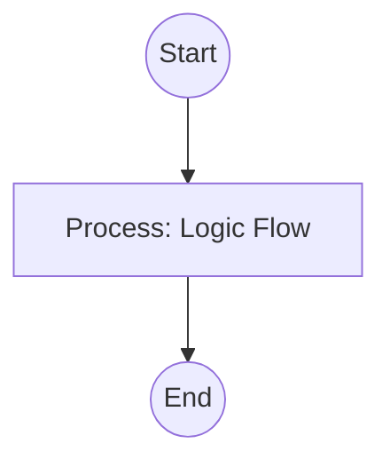

## Context
Identifies recurring patterns (exemplary or problematic) in the codebase or context.

# Scan Codebase Patterns

This skill identifies real-world usage patterns to support standard codification.

## Architecture

## Execution Steps

1. **Grep**: Search for keywords related to the `domain`.
2. **Cluster**: Group results by semantic similarity (e.g., all instances of "retry" logic).
3. **Classify**:
    - **Positive**: Patterns that are clean, modular, and follow kernel principles.
    - **Negative**: Patterns that are complex, un-owned, or non-atomic.
4. **Report**: provide a detailed list of practices and their frequency.

## Verification Protocol
1. Perform a manual dry-run of the execution steps.
2. Verify that the output matches the expected result defined in the Quality Gate.

## Quality Gate

Pattern discovery is governed by the **[Naming Standard](../standards/naming.standard.md)**.
- **Verification**: The scan must identify the "folder gravity" of the patterns to help determine their hierarchical level.
- **Enforcement**: Problematic patterns found in core folders must be flagged for immediate **Semantic Audit**.
