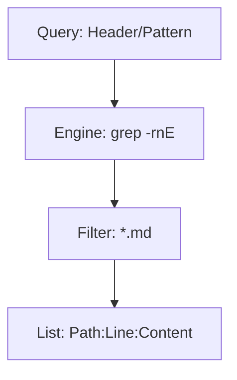

# Kernel Semantic Search

## Context
Finding specific patterns, headers, or references across 100+ files requires a high-speed search engine. This skill uses `grep` to provide instant, line-numbered results for any semantic query.

## Architecture

## Execution Steps
1. Define the query pattern (e.g., `## Quality Gate`).
2. Specify the domain (e.g., `agents/`).
3. Execute and process the line-numbered results.

## Verification Protocol
1. Search for a known string (e.g., `id: operator.agent`).
2. Verify that `agents/operator.agent.md` is returned with the correct line number.

## Quality Gate
- **Verification**: Output must include line numbers for rapid navigation.
- **Enforcement**: Must be used for all "Where is X defined?" queries to save tokens.
