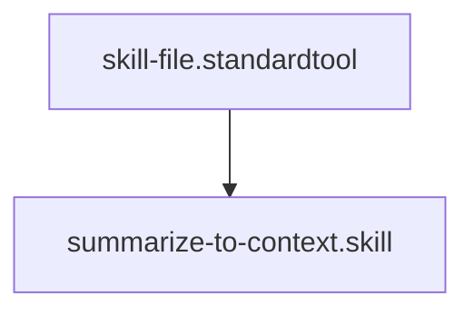

## Context
Extracts decisions, rationales, and key technical findings from a conversation into a structured context file.


# Summarize to Context

This skill implements the "Context Management" directive by distilling transient conversation history into persistent repository knowledge.


## Architecture


## Extraction [Heuristics](glossary/heuristics.glossary.md)

Focus on:
- **Decisions**: What was agreed upon? (e.g., "Move glossary to root").
- **Rationales**: Why was it decided? (e.g., "To increase visibility").
- **Technical Specs**: New IDs, schemas, or naming conventions established.
- **Open Questions**: Anything left unresolved for the next session.

## Format

```markdown
## [Date] — [Brief Topic]

- **Key Decision**: ...
- **Rationale**: ...
- **Impact**: ... (e.g., "Updated 5 files in /standards")
- **Open Questions**: ...
```

## Verification Protocol
1. Perform a manual dry-run of the execution steps.
2. Verify that the output matches the expected result defined in the Quality Gate.
