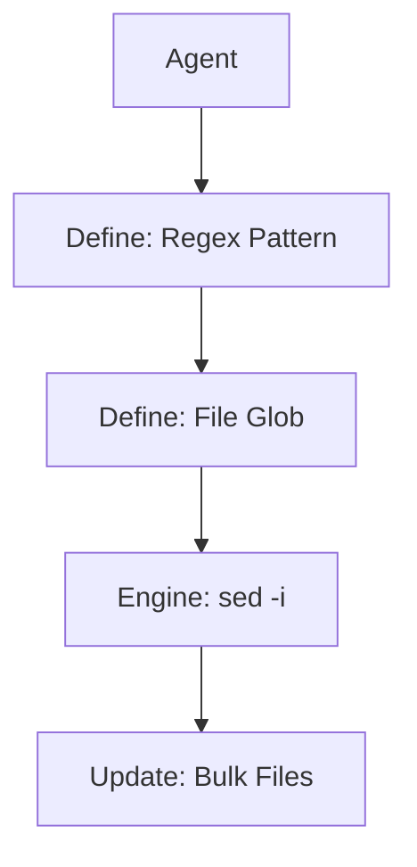

# Surgical Refactor

## Context
Mass-updating IDs, tags, or headers across 100+ files is slow and token-expensive if done manually. This skill uses `sed` to perform surgical, bulk updates in milliseconds.

## Architecture

## Execution Steps
1. **Define Pattern**: Identify the specific string or regex to be replaced.
2. **Define Scope**: Specify the file glob (e.g., `glossary/*.md`).
3. **Execute**: Run the `sed` command.
4. **Verify**: Use `grep` to confirm the replacement.

## Verification Protocol
1. Create a test file with `test_string`.
2. Run `sed -i '' 's/test_string/hardened_string/g' test_file.md`.
3. Verify the file contains `hardened_string` using `cat`.

## Quality Gate
- **Verification**: Must be run with specific globs to avoid accidental global corruption.
- **Enforcement**: Large-scale refactors (>10 files) must use this skill instead of manual editing.
