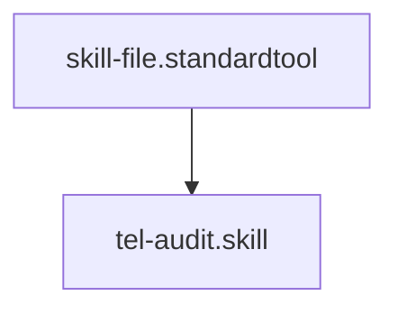

## Context
Scans codebase strings and configurations for violations of the Telemetry Naming Standard.

# Audit Telemetry Naming

This skill provides automated enforcement for global observability standards. It ensures that every metric and span follows the `<pillar>.<module>.<action>` pattern.

## Architecture

## Execution Steps

1. **Grep**: Search for string patterns that look like telemetry keys (e.g., in `span.start()`, `metrics.increment()`, or JSON configs).
2. **Regex Validation**:
    - Ensure the key uses dot-notation (at least two dots).
    - Ensure the key contains only lowercase alphanumeric characters and dots.
    - Validate against the 3-part requirement: `^[a-z0-9]+\.[a-z0-9]+\.[a-z0-9]+$`.
3. **Report**: List all keys that fail the regex check and their file/line numbers.

## Verification Protocol
1. Perform a manual dry-run of the execution steps.
2. Verify that the output matches the expected result defined in the Quality Gate.

## Quality Gate

Telemetry integrity is governed by the **[Telemetry Naming Standard](../standards/tel-naming.standard.md)**.
- **Verification**: The audit must identify the specific "Part" (Pillar, Module, or Action) that is missing or malformed.
- **Enforcement**: Non-compliant keys are **Unacceptable (U)** and will block the **Self-Healing Loop**.
