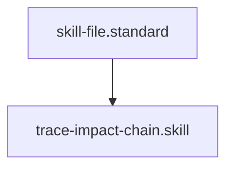

# Semantic Impact Analyzer

## Context
Architectural drift is caused by localized changes that ignore global dependencies. This skill ensures that before a **Glossary Term**, **Standard**, or **Skill** is modified, the agent is aware of every node that will be affected by the change.

## Architecture

## Execution Steps
1. **Engine Invocation**: Run `impact_analyzer.py` with the ID of the node you intend to change.
2. **Analysis**: Review the `dependents` list to understand the scale of the required update.
3. **Planning**: Use the output to build a comprehensive **Implementation Plan** that covers all affected nodes.

## Verification Protocol
1. Run `python3 drivers/kernel/impact_analyzer.py skill.glossary`.
2. Verify that every skill file (which references `skill.glossary`) is listed in the output.

## Quality Gate
- **Verification**: Output must be a valid JSON impact report.
- **Enforcement**: Mandatory step before any **Propose** or **Commit** action involving core Kernel nodes.
