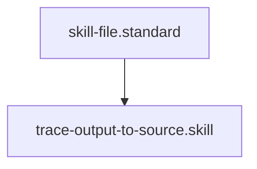

## Context
Scans conversation logs to identify the chain of agents, instructions, and skills that contributed to a specific output.

# Trace Output to Source

This skill enables "Root Cause Analysis" for the AI Kernel by mapping an output back to its governing logic.

## Architecture

## Execution Steps

1. **Log Scan**: Search the conversation `overview.txt` or logs for the `output_snippet`.
2. **Backtrack**: Identify the `run_command` or `write_to_file` actions immediately preceding the output.
3. **Map Logic**:
    - Identify which **Instruction** was active (via the `id:` in the file being read or written).
    - Identify which **Agent** performed the action.
    - Identify the **Standard** linked in the active instruction's frontmatter.
4. **Report**: provide a "Causal Chain" of components for the **Semantic Auditor** to review.

## Verification Protocol
1. Perform a manual dry-run of the execution steps.
2. Verify that the output matches the expected result defined in the Quality Gate.

## Quality Gate

Traceability is governed by the **[Kernel Standard](../standards/kernel.standard.md)**.
- **Verification**: The trace must reach back to at least one **Standard** (PADU table).
- **Enforcement**: If an output cannot be traced back to a specific kernel component, the action is marked as **Un-owned** and a new standard must be codified.
