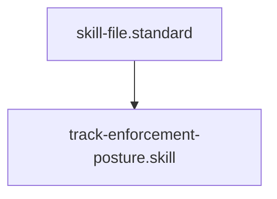

# Enforcement Maturity Tracker

## Context
Our goal is 100% Deterministic Governance. This skill tracks our progress by analyzing the PADU tables in every standard to identify which rules are backed by code and which still rely on human/AI judgment.

## Architecture

## Execution Steps
1. **Engine Invocation**: Run `enforcement_tracker.py` against the `standards/` directory.
2. **Analysis**: Identify standards with low maturity scores (< 0.5).
3. **Hardening**: Prioritize these standards for "Code-Backed" hardening waves.

## Verification Protocol
1. Create a "Legacy Standard" with 10 manual rules.
2. Run `python3 drivers/enforcement_tracker.py`.
3. Verify that the maturity score is reported as `0.0`.
4. Add a `.skill` to one of the rules and verify the score increases to `0.1`.

## Quality Gate
- **Verification**: Output must be a valid JSON maturity report.
- **Enforcement**: All core standards must achieve > 0.8 maturity by Phase 5.
