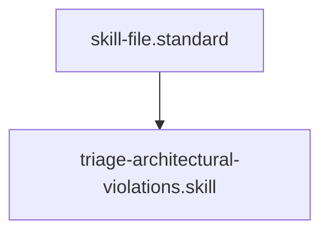

# Triage Architectural Violations

## Context
This skill provides the deterministic logic for ranking "Debt" in the AI Kernel. It ensures that critical structural failures are always addressed before secondary documentation gaps.

## Architecture

## Execution Steps
1. **P0 (Structural)**: Identify ID collisions, naming violations, or missing mandatory suffixes.
2. **P1 (Connectivity)**: Identify orphans or broken links in the Knowledge Graph.
3. **P2 (Semantic)**: Identify violations of `Usage Constraints` or `Verification Protocols`.
4. **P3 (Documentation)**: Identify missing headers (`## Context`, etc.) or Mermaid diagrams.

## Verification Protocol
1. Input a mixed list of 10 violations.
2. Output a sorted list where all P0s appear before P1s, and so on.
3. Verify that the reasoning for each tier matches the **Remediation Triage Logic** prompt.

## Quality Gate
- **Verification**: Triage results must be 100% consistent across multiple audit passes.
- **Enforcement**: Any remediation plan that addresses a lower priority while a higher priority remains is **Unacceptable (U)**.
