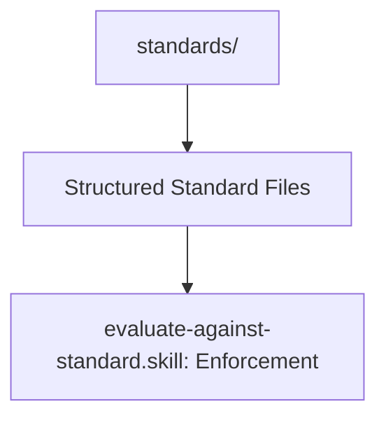

# Standards Manifest

## Context
This folder contains the formal governance rules and quality bars for the AI Kernel.

## Architecture

## File Registry

| ID | Type | Summary |
|---|---|---|
| `kernel.standard` | Standard | Root governance and structural rules. |
| `standard-file.standard` | Standard | Meta-standard for all standard files. |
| `skill-file.standard` | Standard | Meta-standard for atomic skills. |
| `instruction-file.standard` | Standard | Meta-standard for workflows. |
| `agent-file.standard` | Standard | Meta-standard for autonomous agents. |
| `glossary-entry.standard` | Standard | Meta-standard for glossary terms. |
| `capability.standard` | Standard | Rules for granting agent capabilities. |
| `manifest.standard` | Standard | Rules for machine-readable READMEs. |
| `synonym.standard` | Standard | Rules for discovery-friendly naming. || `context-lifecycle.standard` | Standard | Rules for context management. |
| `atomic-extraction.standard` | Standard | Rules for SSOT de-conflation. || `operability.standard` | Standard | Holistic 3-pillar operability framework. |
| `naming.standard` | Standard | Rules for deterministic naming. |
| `quality-gate.standard` | Standard | Rules for verification and enforcement. |

## Quality Gate
- **Verification**: All standards must include a PADU table and a Tier-specific hardening section.
- **Enforcement**: This manifest must be in 1:1 sync with the filesystem.
