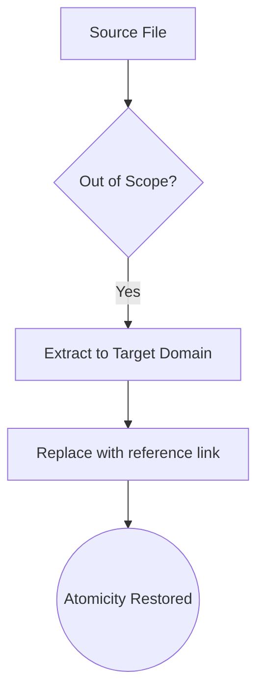

# Atomic Extraction Standard

## Context
This standard defines the "De-conflation" protocol. To maintain the "Hardness" of the AI Kernel, every file must only contain content relevant to its tier. When a file is found to contain "Foreign Logic" (e.g., a Skill containing an Instruction), it must be extracted and replaced with a reference link.

## Architecture

## Extraction Rules

| Source Content | Correct Target Domain | Action |
|---|---|---|
| Term Definition | `glossary/*.glossary.md` | Extract to Glossary; Link via [term]. |
| Multi-tool logic | `instructions/*.instruction.md` | Extract to Instruction; Link via ID. |
| Reusable AI logic | `prompts/*.prompt.md` | Extract to Prompt; Link via frontmatter. |
| Verification logic | `skills/*.skill.md` | Extract to Skill; Link via ID. |

## PADU Table

| Practice | Rating | Rationale | Enforcement | Exception |
|---|---|---|---|---|
| Immediate Extraction | **P** | Prevents technical debt from compounding. | `perform-atomic-extraction.instruction` | None |
| Link-back after Extraction | **P** | Maintains reachability and context. | `linkage-specialist.agent` | None |
| Inline duplication | **U** | Violates SSOT; leads to semantic drift. | `audit-redundant-content.skill` | None |
| Narrating the extraction | **D** | "I moved this here" is noise; the link is the truth. | Agent Audit | None |

## Rationale
"Semantic Bleeding" is the primary cause of architectural decay. By mandating that information lives exactly where it is defined, we ensure that updates to a concept (e.g., a naming rule) propagate globally without manual search-and-replace.

## Enforcement
The posture is **Hybrid-Automated**. The **Semantic Auditor** identifies bleeding, and the **Librarian** orchestrates the extraction.
