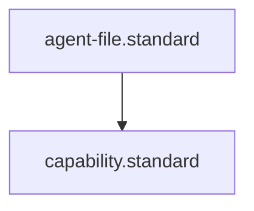

# Capability Standard

## Context
This standard governs the granting of "Licenses to Act" within the AI Kernel. It ensures that agents are only equipped with the tools necessary for their custodial domain, preventing accidental side effects and structural drift.

## Architecture

## Mandatory Sections
1. **Context**: Rationale for the agent's capability profile.
2. **Capability Registry**: Explicit list of Skill/Instruction IDs.
3. **Usage Verification**: How the agent's use of these capabilities is tracked.

## PADU Table

| Practice | Rating | Rationale | Enforcement | Exception |
|---|---|---|---|---|
| Least Privilege | **P** | Agents should only have capabilities for their scope. | doc-audit.skill | Tier 1 Owners |
| Mandatory Registry | **P** | Every capability must be an existing `.skill` or `.instruction`. | `doc-audit.skill` | None |
| Capability-Scope Alignment | **P** | Skill capabilities must align with the agent's glob scope. | `semantic-auditor.agent` | None |
| Ghost Capabilities | **U** | Using a skill not listed in the frontmatter. | `perform-meta-audit.instruction` | None |
| Universal Grant | **D** | Granting `[all]` to a Tier 2 SME. | Flynn Review | None |

## Rationale
By tokenizing actions as "Capabilities," we make the AI Kernel's security model **Explicit**. We no longer trust that an agent "knows what to do"; we verify that they are "Licensed to do it."

## Enforcement
The posture is **Automated**. The **Integrity Guardian** verifies that all skill invocations in an agent's logs match their `capabilities` manifest.
\n## Quality Gate\n- **Verification**: All capability nodes must define a machine-verifiable interface.\n- **Enforcement**: Capabilities without a skill implementation are prohibited.
