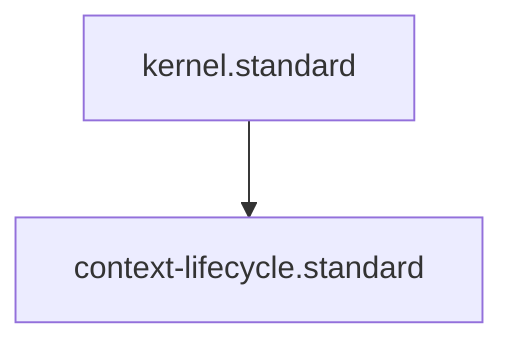

# Context Lifecycle Standard

## Context
Context is the "Long-Term Memory" of the AI Kernel. To prevent "Context Poisoning" (relying on outdated or conflicting data), this standard defines the lifecycle of files in the `/context/` directory.

## Architecture

## Mandatory Lifecycle States
1. **Active**: Context related to the current task or latest audit.
2. **Historical**: Context from a previous successful task (used for regression).
3. **Obsolete**: Context that has been superseded by a newer standard or audit.

## PADU Table

| Practice | Rating | Rationale | Enforcement | Exception |
|---|---|---|---|---|
| Distill Raw Logs | **P** | Saves token space and reduces noise. | `summarize-to-context.skill` | Forensics |
| Mark Versioned Context | **P** | Ensures we don't follow v1.0 logic in a v2.0 world. | `doc-audit.skill` | None |
| Prune Obsolete Context | **P** | Prevents "Semantic Pollution." | `maintain-kernel-integrity.instruction` | None |
| Rely on 6-month old logs | **D** | Architectural drift makes old logs misleading. | evaluate-against-standard.skill | None |

## Rationale
Context should be a "Refined Resource." By mandating distillation and pruning, we ensure that agents are always working with the most accurate and compact "Current State" possible.

## Enforcement
The posture is **Agent-Audited**. The **Librarian** manages the Distillation and Archival of context.
