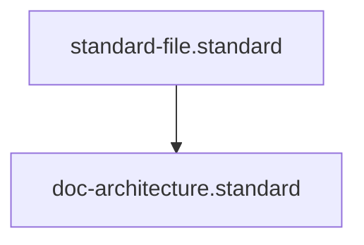

# Architecture Documentation Standard

## Context
The Architecture layer provides "Orientation over Detail." It serves as the high-level map of the system, helping users and agents conceptually locate the right component-level documentation.

## Architecture

## PADU Table

| Practice | Rating | Rationale | Enforcement | Exception |
|---|---|---|---|---|
| Use Mermaid for Global Maps | **P** | Provides a visual "You Are Here" signpost. | `doc-audit.skill` | None |
| Link to Local READMEs | **P** | Connects the global map to the atomic implementation. | `linkage-specialist.agent` | None |
| Abstract over Implementation | **P** | Keeps global docs stable even as implementation changes. | `semantic-auditor.agent` | None |
| Deep Implementation Details | **U** | Belongs in the Local README; creates maintenance drift. | `doc-audit.skill` | None |

Architecture documentation is about **Navigability**. Its primary goal is to help a human or agent answer the question: "Where is the code that handles X?"

## Enforcement
The posture is **Hybrid**. The **Linkage Specialist** verifies that all components visualized in the architecture maps have a corresponding local README.
