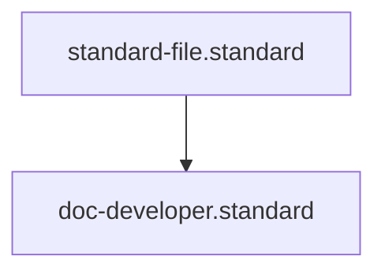

# Developer Documentation Standard

## Context
Developer documentation is the onboarding engine of a project. Its goal is to minimize "Time to First Commit" by providing a clear path from a fresh clone to a local development environment.

## Architecture

## Mandatory Sections
1. **Local Setup**: Step-by-step instructions for installing dependencies and running the app locally.
2. **Contribution Guidelines**: How to submit PRs, branching strategy, and commit message standards.
3. **Build & Test**: Commands for running the build pipeline and the test suite.

## PADU Table

| Practice | Rating | Rationale | Enforcement | Exception |
|---|---|---|---|---|
| One-Step Setup Script | **P** | Minimizes onboarding friction and manual errors. | `doc-audit.skill` | Complex infra |
| Document Build Internals | **P** | Helps developers debug pipeline failures. | Agent Audit | None |
| Hardcoded Credentials | **U** | Fatal security risk; use environment templates. | `doc-audit.skill` | None |
| Outdated Setup Steps | **U** | Causes developer frustration and setup decay. | `maintain-kernel-integrity.instruction` | None |

Internal documentation should be optimized for **Speed** and **Clarity**. It assumes the reader has access to the source code and focuses on how to modify it safely.
