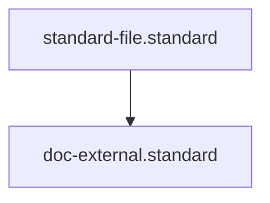

# External Documentation Standard

## Context
External documentation is the "Product Face" of the codebase. It is designed for consumers who interact with the system via its public interfaces (UI or API) and requires a high level of polish and professional clarity.

## Architecture

## Mandatory Sections
1. **User Manual**: Task-oriented guides for end-users (the "What" and "How").
2. **API Specification**: Formal documentation of all public endpoints (OpenAPI/Swagger).
3. **Release Notes**: Clear communication of new features and breaking changes.

## PADU Table

| Practice | Rating | Rationale | Enforcement | Exception |
|---|---|---|---|---|
| Use OpenAPI/Swagger | **P** | Provides interactive, machine-readable API documentation. | `doc-audit.skill` | None |
| Task-Oriented Manuals | **P** | Focuses on what the user wants to achieve, not just button descriptions. | Agent Audit | None |
| Include Examples | **P** | Reduces integration time for API consumers. | Agent Audit | None |
| Implementation Detail Leaks | **U** | Confuses customers with irrelevant technical debt. | `doc-audit.skill` | Open Source |
| Vague Release Notes | **D** | "Bug fixes and improvements" provides zero customer value. | Agent Audit | None |

External documentation must prioritize **Simplicity** and **Interface Stability**. It should hide the "Sausage-Making" details of the implementation to focus on user success.
