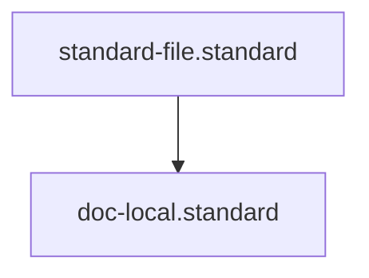

# Local Documentation Standard

## Context
Local documentation provides "Truth at the Source." It is scoped strictly to the directory it resides in, ensuring that technical details are located exactly where they are most relevant to the developer or agent.

## Architecture

## PADU Table

| Practice | Rating | Rationale | Enforcement | Exception |
|---|---|---|---|---|
| Directory-Scoped Context | **P** | The directory structure provides the primary context. | `doc-audit.skill` | None |
| Link over Rehash | **P** | Prevents definition drift and maintains atomicity. | `doc-audit.skill` | Common language |
| Technical Detail Depth | **P** | This is the ONLY place for implementation details. | evaluate-against-standard.skill | None |
| Global Architecture in Local Doc | **U** | Violates scoping; link to `docs/architecture` instead. | `doc-audit.skill` | None |
| Redundant Definitions | **U** | Violates SSOT; use Glossary links. | `audit-redundant-content.skill` | None |

By forcing local READMEs to stay atomic, we ensure that a developer can understand a component without being overwhelmed by global system complexity.

## Enforcement
The posture is **Automated**. The **Librarian** verifies that local READMEs do not exceed a "Semantic Scope" (e.g., they don't explain concepts outside their parent directory).
