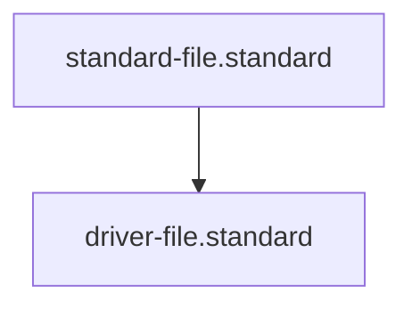

---
id: driver-file.standard
title: Driver File Standard
type: standard
requirements: [id, summary, "## Interface", "## Implementation"]
tags: [execution, automation, connectivity, rules, governance]
summary: Standards for atomic, directly executable logic files that implement Kernel Skills.
parent_standard: standard-file.standard
glossary_refs: [agent.glossary, context.glossary, driver.glossary, skill.glossary, standard.glossary]
---# Driver File Standard

## Context
A Driver is the "Physical Actuator" of a Skill. While a Skill defines the agent's intent, the Driver performs the actual work (calling an API, running a command, parsing a file). Drivers must be atomic, deterministic, and easily replaceable.

## PADU Table

| Practice | Rating | Rationale | Enforcement | Exception |
| :--- | :--- | :--- | :--- | :--- |
| **Atomic Logic** | **P** | Each driver must do one thing well. | flynn.agent | Complex aggregators. |
| **Deterministic Output** | **P** | Results must be predictable and machine-readable (JSON). | flynn.agent | Streaming outputs. |
| **ID Persistence** | **P** | Every driver must have a unique ID in its header. | id-auditor.skill | Temporary test scripts. |
| **Self-Contained** | **A** | Avoid complex local dependencies. Prefer standard libraries or MCP protocols. | flynn.agent | Specialized ML drivers. |

## Execution Steps
1. **Define Interface**: Document inputs and outputs in the driver header.
2. **Implement Logic**: Write the Python/Bash code.
3. **Audit**: Run `evaluate-against-standard.skill` to ensure compliance.

## Quality Gate
- **Verification**: Drivers must be directly executable from the CLI.
- **Enforcement**: Drivers failing the deterministic test are **Unacceptable (U)**.

## Architecture

\n## Enforcement\n| Practice | Rating | Rationale | Enforcement | Exception |\n| :--- | :--- | :--- | :--- | :--- |\n| **Atomic Logic** | **P** | Keep it simple. | flynn.agent | None. |\n
