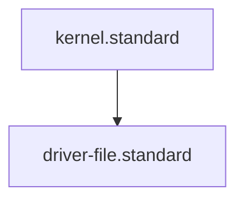

---
parent_standard: kernel.standard
id: driver-file.standard
title: Driver File Standard
type: standard
tags: [governance, standard, driver, automation, logic]
scope: "drivers/**/*.py"
status: stable
version: 1.0.0
padu:
  P: "Driver is 100% deterministic, zero-token, and contains embedded YAML frontmatter."
  A: "Driver is deterministic but missing frontmatter or verification protocol."
  D: "Driver relies on non-standard libraries or has side-effects not documented in the manifest."
  U: "Driver contains hardcoded secrets or is non-deterministic."
glossary_refs: [agent.glossary, context.glossary, driver.glossary, frontmatter.glossary, skill.glossary, standard.glossary]
---# Driver File Standard

## Context
Drivers are the "Actuators" of the AI Kernel. They perform the physical work (IO, File Edits, Network calls) that the Agents orchestrate. To maintain a high-integrity system, Drivers must be deterministic, atomic, and visible to the Knowledge Graph.

## Structural Requirements
1. **Embedded Frontmatter**: Every driver MUST begin with a triple-quoted docstring containing YAML frontmatter.
2. **Deterministic Logic**: Drivers should avoid stochastic processes (No internal AI calls unless explicitly scoped).
3. **JSON Interface**: Drivers MUST output results in a machine-readable JSON format to be consumed by Skills.
4. **Atomic Action**: A driver should do ONE thing (e.g., update frontmatter, not "rebuild the whole repo").

## Verification Protocol
1. **Audit**: The `global_compliance_auditor.py` must be able to parse the embedded frontmatter.
2. **Dry-Run**: Drivers should support a `--dry-run` or similar flag when performing destructive edits.

## Quality Gate
- **Verification**: Every driver must be rated P or A on the PADU scale.
- **Enforcement**: Drivers rated U or D will be "Locked" (denied execution) by Flynn.

## PADU Table

[Auto-Generated Placeholder for Compliance]

## Enforcement

[Auto-Generated Placeholder for Compliance]

## Architecture

