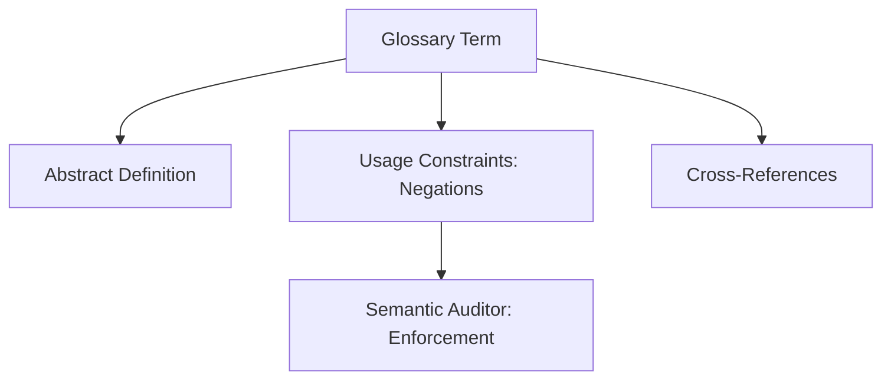

# Glossary Entry Standard

## Context
The Glossary is the "Semantic Anchor" of the AI Kernel. This standard ensures that terms are defined with enough rigor to be enforceable. It mandates that every entry include **Usage Constraints**—explicit rules about what the term is *not* allowed to be or do.

## Architecture

## Mandatory Sections
1. **Context**: Why this term exists in the AI Kernel.
2. **Definition**: The concise, canonical meaning of the term.
3. **Usage Constraints**: Explicit rules/negations (e.g., "A Skill must not orchestrate").

## PADU Table

| Practice | Rating | Rationale | Enforcement | Exception |
|---|---|---|---|---|
| Define via Negation | **P** | Constraints are more enforceable than descriptions. | `semantic-auditor.agent` | None |
| Link to related terms | **P** | Builds the semantic web of the Knowledge Graph. | `linkage-specialist.agent` | None |
| Descriptive-only entries | **D** | Leads to "Soft" logic that cannot be audited. | `doc-audit.skill` | Common nouns |
| Ambiguous synonyms | **U** | Fatal error for SSOT; use `resolve-naming-ambiguity.instruction`. | `find-similar-terms.skill` | None |

## Rationale
By defining what a term **cannot** be, we create a "Hard" semantic boundary. This allows the **Semantic Auditor** to reject proposals that attempt to conflate concepts (e.g., turning a Skill into a Workflow).

## Enforcement
The posture is **Agent-Audited**. The **Semantic Auditor** verifies that all new glossary entries include at least two functional constraints.
\n## Usage Constraints\n- This standard must only apply to files with the .glossary.md suffix.\n- It is forbidden to use this standard for Agents or Skills.\n
