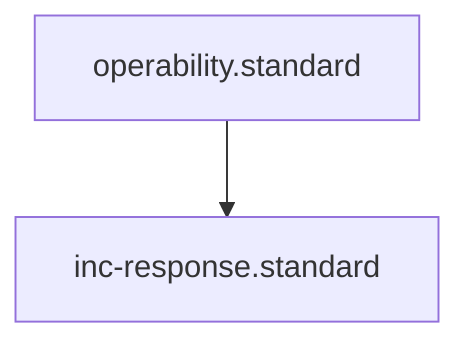

# Incident Response Standard

## Context
Incident Response is the process of diagnosing and correcting live production issues. This standard mandates that every functional component must have a "Restoration Kit" consisting of a Dashboard, a Runbook, and an Action set.

## Architecture

## The 3-Piece Restoration Kit

### 1. Span Diagnostic Dashboard (`*.dashboard.md`)
- **Purpose**: Identifies *which* parts are failing.
- **Rule**: Must visualize health status for all mandatory spans in the component.

### 2. Span Diagnostic Runbook (`*.runbook.md`)
- **Purpose**: Explains *how* to identify the root cause for a specific failing span.
- **Rule**: Must link a "Failing Signal" to a specific "Corrective Action."

### 3. Span Actions (`*.md` or `*.md`)
- **Purpose**: The atomic steps to **Verify**, **Apply**, and **Re-verify**.
- **Rule**: Actions must be deterministic and repeatable.

## PADU Table

| Practice | Rating | Rationale | Enforcement | Exception |
|---|---|---|---|---|
| Use `Verify -> Apply -> Re-verify` | **P** | Ensures the corrective action actually fixed the issue. | `inc-audit.skill` | None |
| Automated Runbook Linkage | **P** | Every failing span in a dashboard must link to its runbook. | `linkage-specialist.agent` | None |
| Manifest-style Dashboards | **P** | Provides a high-level map of system health. | `librarian.agent` | None |
| Narrative Runbooks | **D** | "Walls of text" are hard to follow during an incident. | `semantic-auditor.agent` | None |
| Missing Restoration Actions | **U** | A runbook that says "Fix it" without an action is useless. | `inc-audit.skill` | None |

Restoration time is a function of "Path Clarity." By mandating the 3-piece kit, we eliminate the need for "Creative Troubleshooting" during an incident, replacing it with "Deterministic Restoration."

## Enforcement
The posture is **Automated**. The **Linkage Specialist** verifies that every span defined in a Telemetry standard has a corresponding dashboard entry and runbook.
