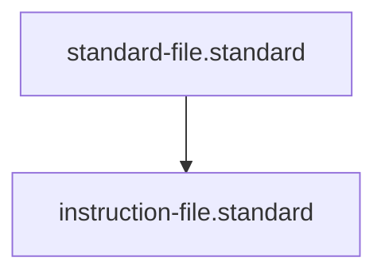

# Instruction File Standard

## Context
Instructions are the "Workflows" of the AI Kernel. They coordinate multiple skills to achieve a goal. To prevent "Logic Drift," this standard mandates that every instruction define both **Preconditions** (Start State) and **Postconditions** (End State).

## Architecture

## Mandatory Sections
1. **Context**: The high-level goal of the workflow.
2. **Preconditions**: Verifiable conditions that must be true to start.
3. **Steps**: The sequence of skills and decisions.
4. **Postconditions**: Verifiable conditions that must be true to conclude.

## PADU Table

| Practice | Rating | Rationale | Enforcement | Exception |
|---|---|---|---|---|
| State-based Postconditions | **P** | Ensures the instruction actually achieved its goal. | `doc-audit.skill` | None |
| Coordination of Skills | **P** | Instructions should use skills as their building blocks. | evaluate-against-standard.skill | Trivial logic |
| Recursive Verification | **P** | Re-run preconditions at the end to ensure stability. | evaluate-against-standard.skill | None |
| Narrative Goals | **D** | "Make it better" is not a verifiable postcondition. | `semantic-auditor.agent` | None |
| Skill Logic in Instruction | **U** | Violates atomicity; move logic to a `.skill.md`. | `audit-for-architectural-violations.skill` | None |

## Rationale
By mandating **Postconditions**, we move from "Instruction Following" to "Goal Fulfillment." An agent is not finished when the steps are done; they are finished when the system state matches the postconditions.

## Enforcement
The posture is **Agent-Audited**. The **Flynn** agent verifies that all new instructions have verifiable end-states.
