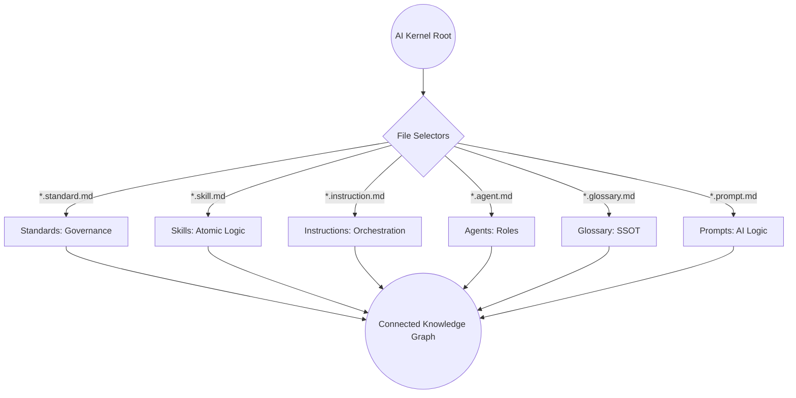

# Kernel Standard

## Context
The **Kernel Standard** is the absolute source of truth for the AI Kernel's architecture. It establishes the "Hardness" of the system by mandating global uniqueness, reachability, and deterministic discovery. Without this root standard, the Knowledge Graph would collapse into a collection of isolated, ambiguous files.

## Architecture

## Deterministic File Selectors
To ensure that agents and audits target the correct file types, the following naming conventions are mandatory:

| File Type | Pattern (Glob) | Purpose |
|---|---|---|
| **Standard** | `*.standard.md` | Governance and Quality Bars |
| **Skill** | `*.skill.md` | Atomic Logic and Tool Usage |
| **Instruction** | `*.instruction.md` | Orchestration and Workflows |
| **Agent** | `*.agent.md` | Autonomous Role Definitions |
| **Glossary** | `*.glossary.md` | Canonical Term Definitions |
| **Prompt** | `*.prompt.md` | Reusable AI Instructions |
| **Runbook** | `*.runbook.md` | Diagnostic and Restoration Logic |
| **Dashboard** | `*.dashboard.md` | Observability Maps (System Health) |
| **Manifest** | `README.md` | Folder-level Maps (Excluded from Graph) |
| **Context** | `context/*.md` | Raw Logs and Learning Data |

## PADU Table

| Practice | Rating | Rationale | Enforcement | Exception |
|---|---|---|---|---|
| Global ID Uniqueness | **P** | Prevents reference ambiguity. | `check-id-uniqueness.skill` | None |
| Reachability from Root | **P** | Every node must have an incoming reference path. | `audit-repository-connectivity.skill` | README.md |
| Deterministic Suffixes | **P** | Ensures automated tools can safely select files. | `ls` scan | README.md |
| Maintain Manifests | **P** | Folder READMEs must list all current files. | `maintain-kernel-integrity.instruction` | None |
| Explicit Domain Ownership | **P** | Every file must belong to a Tier 1 agent's scope. | Agent Audit (Auditor) | None |
| Use `.{filetype}.md` naming | **P** | Enables deterministic discovery. | `ls` / Agent Audit | README.md |
| Hierarchical Standards | **P** | Organizes rules logically. | `verify-repository-integrity.instruction` | None |
| Link to Glossary for all terms | **P** | Eliminates definition drift. | `audit-redundant-content.skill` | Common language |
| Missing Frontmatter | **U** | Breaks the Knowledge Graph. | `audit-frontmatter-completeness.skill` | None |
| Orphaned Nodes | **U** | Dead nodes pollute the Knowledge Graph. | `audit-repository-connectivity.skill` | README.md |
| ID Collision | **U** | Fatal error for graph integrity. | `check-id-uniqueness.skill` | None |

"Hardness" in a knowledge system is defined by its resistance to isolation and ambiguity. By mandating global uniqueness and reachability, we ensure that every piece of information in the kernel is a functional part of the whole.

## Enforcement
The Kernel posture is **Automated**. Structural integrity (naming, ID uniqueness, reachability) is enforced by the **Integrity Guardian** and **Linkage Specialist**.
