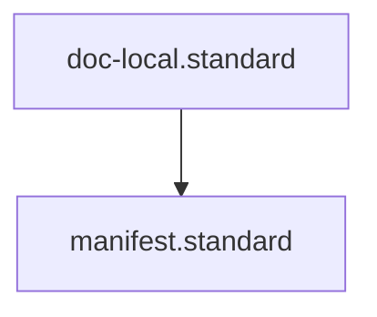

# Manifest Standard

## Context
Manifests (`README.md` files) are the "Discovery Maps" of the AI Kernel. To ensure they are machine-navigable, this standard mandates a structured table format for file listings.

## Architecture

## Mandatory Content
1. **Title**: The folder name or domain title.
2. **Context**: Description of the folder's purpose.
3. **File Registry**: A table containing:
    - **ID**: The file's unique ID.
    - **Type**: Standard, Skill, Instruction, etc.
    - **Summary**: Concise description.

## PADU Table

| Practice | Rating | Rationale | Enforcement | Exception |
|---|---|---|---|---|
| Structured Table Format | **P** | Enables deterministic parsing by agents. | `doc-audit.skill` | Root README |
| Include Mandatory Suffixes | **P** | Matches the Kernel's naming standard. | `librarian.agent` | None |
| 1:1 Filesystem Sync | **P** | Prevents "Dead Links" or missing files. | `maintain-kernel-integrity.instruction` | `.DS_Store` etc. |
| Narrative-only Manifests | **U** | Prevents automated discovery. | `doc-audit.skill` | None |

## Rationale
A manifest is not just for humans. By mandating a table, we allow our agents (especially the **Librarian**) to parse a folder's capabilities without having to `ls` and `grep` every file.

## Enforcement
The posture is **Automated**. The **Librarian** agent is the custodian of this standard.
