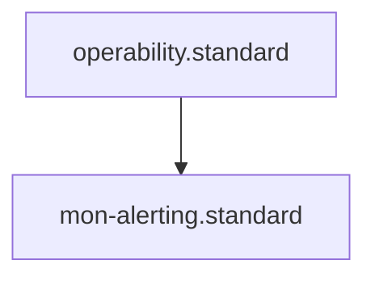

# Monitoring & Alerting Standard

## Context
Monitoring is the system's "Pain Receptor." Its goal is to detect that the system is no longer healthy, not to diagnose *why*. By prioritizing aggregation, we reduce alert fatigue and ensure that a single monitor can cover a wide range of failure modes.

## Architecture

## Monitoring Principles

### 1. Aggregation over Diagnosis
- **Rule**: Create one monitor for many scenarios. 
- **Example**: A single monitor for "API Latency > 500ms" covers database slowness, network congestion, and code inefficiencies simultaneously.

### 2. Detection over Feedback
- **Rule**: Monitors should only trigger when a specific **SLO (Service Level Objective)** is violated.
- **Exclusion**: Do not alert on "Warning" states that do not impact user success.

### 3. Clear Escalation
- **Rule**: Every alert must point directly to a **Span Diagnostic Dashboard** (`*.dashboard.md`).

## PADU Table

| Practice | Rating | Rationale | Enforcement | Exception |
|---|---|---|---|---|
| One Monitor : Many Scenarios | **P** | Maximizes detection coverage with minimal alert noise. | Agent Audit | Trivial components |
| Alert links to Dashboard | **P** | Provides the first step for deterministic restoration. | `linkage-specialist.agent` | None |
| Diagnostic Alerts | **D** | Leads to "Alert Storms" where one root cause triggers 50 alerts. | Agent Audit | Critical safety loops |
| Informational Alerts | **U** | Causes "Alert Fatigue" and leads to ignored production issues. | `mon-audit.skill` | None |

## Rationale
In a high-fidelity telemetry environment, we don't need the monitor to tell us what is wrong. We only need it to tell us that *something* is wrong. We then use the **Diagnostic Dashboard** to perform the surgical diagnosis.

## Enforcement
The posture is **Automated**. The **Linkage Specialist** verifies that every defined Monitor has a corresponding `correlation_id` to its target Dashboard.
