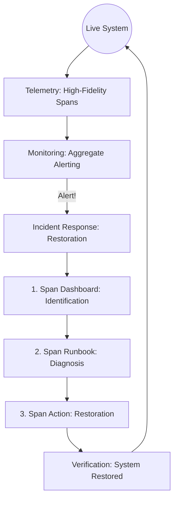

# Operability Standard

## Context
Operability is the "Nervous System" of a production application. This standard establishes a holistic framework where observability signals (Telemetry) feed into detection mechanisms (Monitoring), which trigger structured remediation paths (Incident Response).

## Architecture

## The 3 Pillars

### 1. Telemetry (The Signal)
- **Goal**: High-fidelity root cause analysis.
- **Rule**: "Less is More" - focus on signals that actually indicate component state.
- **Selector**: `*.standard.md` (Governed by `tel-naming.standard.md`).

### 2. Monitoring (The Sensor)
- **Goal**: Detection of unhealthiness.
- **Rule**: Aggregation over Diagnosis. One monitor should cover many scenarios.
- **Enforcement**: Monitors must trigger alerts, not diagnosis.

### 3. Incident Response (The Restoration)
- **Goal**: Rapid restoration of service.
- **Rule**: Systematic use of the 3-piece doc set: Dashboard, Runbook, Actions.

## PADU Table

| Practice | Rating | Rationale | Enforcement | Exception |
|---|---|---|---|---|
| Aggregate Alerting | **P** | One monitor for many scenarios reduces alert fatigue. | `mon-audit.skill` | None |
| High-Fidelity Telemetry | **P** | Ensures enough data for RCA without noise. | `tel-audit.skill` | None |
| Mandatory 3-Piece IR Docs | **P** | Dashboard, Runbook, and Actions are non-negotiable. | `inc-audit.skill` | None |
| Diagnostic Monitors | **D** | Creates multiple alerts for the same root cause. | Agent Audit | None |
| One-off Manual Restoration | **U** | Prevents system learning and repeatability. | `inc-audit.skill` | None |

"Hard" operability relies on the separation of **Detection** and **Diagnosis**. By keeping monitors aggregated and runbooks atomic, we minimize the time-to-restoration while maximizing system stability.

## Enforcement
The posture is **Automated**. We will implement specialized auditors for each pillar to ensure that every new component includes its corresponding dashboard and runbook.
---
**Note**: This standard serves as the parent for `tel-naming.standard`, `mon-alerting.standard`, and `inc-response.standard`.
