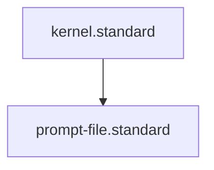

---
parent_standard: kernel.standard
id: prompt-file.standard
title: Prompt File Standard
type: standard
tags: [governance, prompt-engineering, rules, compliance]
summary: Standards for defining reusable AI prompts in the `prompts/` directory.
requirements: ["## Context", "## Context
This standard governs the structure and quality of standalone prompts. It ensures that prompts are modular, versioned, and documented with their intended variables.
## PADU Table
| Practice | Rating | Rationale | Enforcement | Exception |
|
glossary_refs: [agent.glossary, context.glossary, determinism.glossary, frontmatter.glossary, prompt.glossary, skill.glossary, standard.glossary]
---|---|---|---|---|
| Define `variables` | **P** | Lists expected inputs. | `audit-frontmatter-completeness.skill` | None |
| Include `model_recommendation` | **A** | Context for tuning. | doc-audit.skill | Model-agnostic |
| Use Clear Versioning | **P** | Tracks model evolution. | `audit-frontmatter-completeness.skill` | None |
| Hardcoding specific data | **U** | Prevents reusability. | doc-audit.skill | None |
| Vague instructions | **D** | Non-deterministic behavior. | doc-audit.skill | None |

Standardizing prompt formats allows for automated metadata auditing, ensuring that all prompts are properly versioned and variable-defined before use.

## Enforcement
The posture for prompts is **Agent-Audited**. Structural elements (variables, versioning) are caught by metadata audit, but the "quality" and "determinism" of the prompt logic require an audit by the **evaluate-against-standard.skill**.

### Gaps
#### Prompt Injection / Security
**Risk**: Reusable prompts may be written in a way that is vulnerable to injection if the `variables` are not properly sanitized by the calling agent.
**Be Wary Of**: Prompts that ask the model to "ignore all previous instructions" or similar patterns.

#### Regression
**Risk**: A prompt version update may work better for one model but break behavior for another.
**Be Wary Of**: Changing core prompt logic without updating the `version` field.

## Architecture

