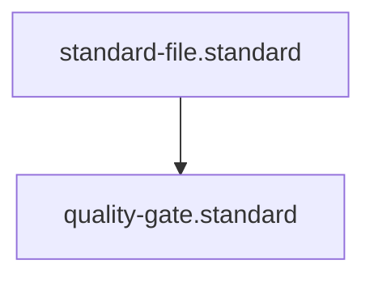

# Quality Gate Standard

## Context
This standard governs the structure and content of `## Quality Gate` sections. It ensures that every atomic action or orchestrated instruction in the kernel has a deterministic verification process and a clear enforcement trigger.

## Architecture

## PADU Table

| Practice | Rating | Rationale | Enforcement | Exception |
|---|---|---|---|---|
| Use `Verification` sub-point | **P** | Defines how to check the output. | `semantic-auditor.agent` | None |
| Use `Enforcement` sub-point | **P** | Defines what happens if the check fails. | `semantic-auditor.agent` | None |
| Link to governing standard | **P** | Gates must have a basis in code. | `integrity-guardian.agent` | None |
| List gate as Execution Step | **U** | Conflates process with verification. | `semantic-auditor.agent` | None |
| Vague/Subjective gate | **D** | Leads to inconsistent audit results. | `semantic-auditor.agent` | None |

Consistency in how we define "Done" is critical for agent reliability. By standardizing the format of Quality Gates, we allow the **Semantic Auditor** to programmatically verify that every skill and instruction has a "unit test" for its logic.

## Enforcement
The posture is **Agent-Audited**. The **Semantic Auditor** verifies the presence and clarity of the two mandatory sub-points (**Verification** and **Enforcement**).

### Gaps
#### Gate Logic Drift
**Risk**: A gate might describe a verification process that is not actually supported by any current skill.
**Be Wary Of**: Gates that promise "Automated Enforcement" but link to standards that are still "Agent-Audited".
