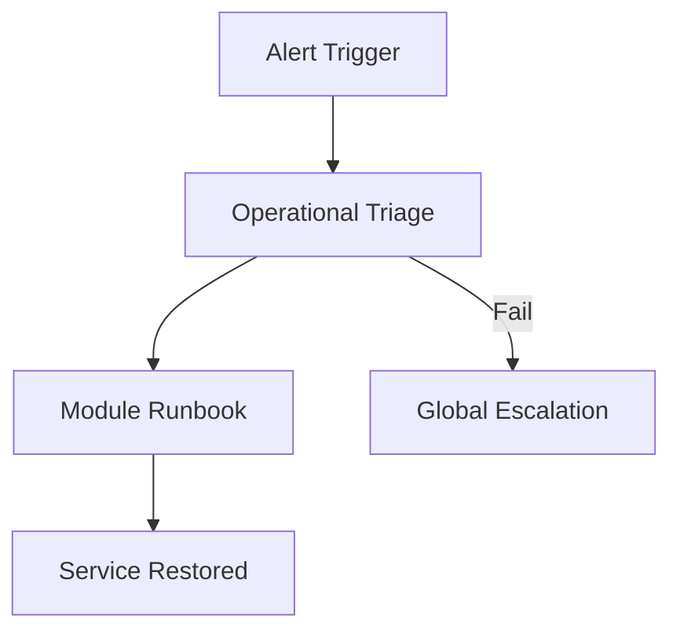

# Universal Runbook Standard

## 1. Severity Matrix
| Severity | Threshold | Response Time |
| :--- | :--- | :--- |
| **SEV-1** | > 10% Error Rate or Total Outage | 15 Mins |
| **SEV-2** | > 1% Error Rate or 2x Latency | 30 Mins |
| **SEV-3** | Degraded Performance | 4 Hours |

## 2. Impact Scope
- **SEV-1**: Universal service failure; all users blocked.
- **SEV-2**: Significant degradation; subset of users or core features affected.

## 3. Triage Protocol
- **Strategy**: Adhere to the [Operational Triage Instruction](../instructions/operational-triage.instruction.md).
- **Action**: Identify the failing span from the SigNoz dashboard and proceed to the corresponding module runbook.

## 4. Escalation Path
- **Action**: If triage fails within the response time window:
  - **Level 1**: Primary On-Call Engineer.
  - **Level 2**: Engineering Leadership.

## 5. Architecture


## Architecture

```mermaid
graph TD
```
