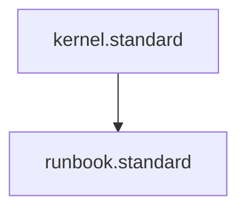

---
id: runbook.standard
title: Universal Runbook Standard
type: standard
tags: [ops, runbook, triage, on-call]
status: stable
version: 1.1.0
parent_standard: kernel.standard
glossary_refs: [context.glossary, instruction.glossary, standard.glossary]
---# Universal Runbook Standard

## Context
A Universal Runbook is the definitive entry point for operational response. It provides the severity matrix and escalation paths required to stabilize a system under duress. This standard ensures that all runbooks are actionable, consistent, and interlocked with the system's telemetry.

## 1. Severity Matrix
| Severity | Threshold | Response Time |
| :--- | :--- | :--- |
| **SEV-1** | > 10% Error Rate or Total Outage | 15 Mins |
| **SEV-2** | > 1% Error Rate or 2x Latency | 30 Mins |
| **SEV-3** | Degraded Performance | 4 Hours |

## 2. Impact Scope
- **SEV-1**: Universal service failure; all users blocked.
- **SEV-2**: Significant degradation; subset of users or core features affected.

## 3. Triage Protocol
- **Strategy**: Adhere to the [Operational Triage Instruction](../instructions/operational-triage.instruction.md).
- **Action**: Identify the failing span from the SigNoz dashboard and proceed to the corresponding module runbook.

## 4. Escalation Path
- **Action**: If triage fails within the response time window:
  - **Level 1**: Primary On-Call Engineer.
  - **Level 2**: Engineering Leadership.

## PADU Table

| Practice | Rating | Rationale | Enforcement | Exception |
|---|---|---|---|---|
| Use Dot-Notation Spans | **P** | Enables deterministic triage mapping. | `otel-naming.standard` | Legacy systems |
| Define Recovery Step | **P** | Ensures runbooks are actionable. | `ops-doc.standard` | None |
| Manual Triage | **D** | Increases MTTR; prefer automated diagnostics. | `operability.standard` | Root Cause Analysis |

## Enforcement
The posture is **Automated**. The AI Kernel's Integrity Guardian verifies that every on-call alert is mapped to a compliant runbook entry.

## Architecture

