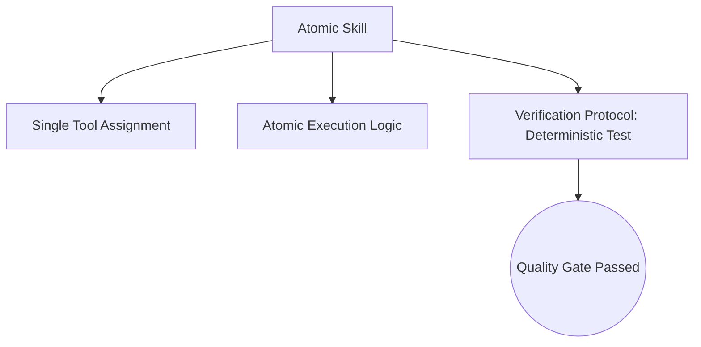

# Skill File Standard

## Context
This standard governs the creation of atomic skills. It enforces the "Single Tool, Single Action" principle. To ensure that skills are truly deterministic, this standard mandates a **Verification Protocol**—the exact steps or commands needed to verify the skill's output.

## Architecture

## Mandatory Sections
1. **Context**: The specific problem this skill solves.
2. **Architecture**: Visual representation of the logic flow.
3. **Execution Steps**: The atomic steps to perform the action.
4. **Verification Protocol**: The machine-executable or deterministic steps to verify success.

## PADU Table

| Practice | Rating | Rationale | Enforcement | Exception |
|---|---|---|---|---|
| Machine-Executable Protocol | **P** | Allows agents to verify their own work without guesswork. | `doc-audit.skill` | Subjective analysis |
| Single Tool per Skill | **P** | Prevents side effects and maintains atomicity. | `audit-for-architectural-violations.skill` | None |
| Post-Execution Verification | **P** | Ensures the deed was actually done. | Agent Audit | None |
| Narrative Protocols | **D** | "Ensure it looks right" is not a deterministic test. | `semantic-auditor.agent` | UI-only skills |
| Multi-tool Orchestration | **U** | Belongs in an Instruction; violates skill atomicity. | `audit-for-architectural-violations.skill` | None |

## Rationale
A skill is a "Function." Like any function, it requires a unit test. The **Verification Protocol** is that unit test, ensuring that the AI Kernel's capabilities are reliable and enforceable.

## Enforcement
The posture is **Automated**. We use `audit-for-architectural-violations.skill` to detect multiple tools and ensure the presence of the `## Verification Protocol` section.
