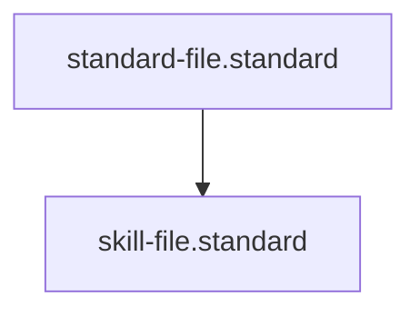

# Skill File Standard

## Context
A Skill is a "Deterministic Function" within the AI Kernel. To maximize token efficiency and accuracy, every skill must be backed by a **Code Implementation** (Python/Bash). The agent's role is to provide the correct inputs to the skill's **Interface** and process the resulting **Structured Output**.

## Architecture

## Mandatory Sections
1. **Context**: The specific problem this skill solves.
2. **Interface**: Definition of inputs and outputs (JSON Schema format).
3. **Implementation**: Path to the code-backend and execution logic.
4. **Verification Protocol**: A machine-executable test command.

## PADU Table

| Practice | Rating | Rationale | Enforcement | Exception |
|---|---|---|---|---|
| Code-Backed Implementation | **P** | Ensures 100% deterministic accuracy. | `doc-audit.skill` | None |
| Strict JSON Interface | **P** | Prevents "Input Drift" and improves token efficiency. | `semantic-auditor.agent` | Simple prompts |
| Self-Contained Logic | **P** | The skill's code should not rely on global state. | `integrity-guardian.agent` | Kernel Globals |
| Natural Language "Tools" | **D** | Relying on the agent to "manually" parse files. | `standards-auditor.agent` | Semantic analysis |
| Multi-Step Orchestration | **U** | Belongs in an Instruction; violates skill atomicity. | `audit-for-architectural-violations.skill` | None |

## Rationale
By separating the **Execution (Code)** from the **Orchestration (Agent)**, we allow the AI Kernel to scale. Agents focus on high-level architecture while the skills provide the high-leverage data needed for decisions.

## Enforcement
The posture is **Automated**. The **evaluate-against-standard.skill** verifies the presence of the `interface` and `implementation` fields and validates the `Verification Protocol` command.
