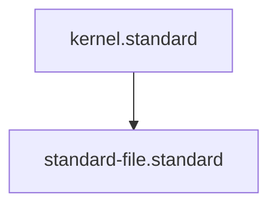

# Standard File Standard

## Context
A Standard is a "Contract." To ensure absolute compliance, every standard must define its **Requirements**—a list of specific, verifiable patterns that constitute a "Pass." This enables automated auditing and prevents quality drift.

## Architecture

## Mandatory Sections
1. **Context**: Background and rationale for the standard.
2. **Architecture**: Visual mapping of the standard's logic or hierarchy.
3. **PADU Table**: The practice/rating enforcement matrix.
4. **Enforcement**: Summary of how the standard is audited (Automated/Agent).

## PADU Table

| Practice | Rating | Rationale | Enforcement | Exception |
|---|---|---|---|---|
| Define `requirements: []` | **P** | Enables deterministic, code-backed auditing. | `standard_auditor.py` | None |
| Include **Enforcement** column | **P** | Ensures standards are actionable. | `doc-audit.skill` | None |
| Define `parent_standard` | **P** | Establishes the hierarchy chain. | `collect-repo-ids.skill` | Root-level |
| Purely Subjective Rules | **U** | Prevents objective evaluation. | `standards-auditor.agent` | None |

## Rationale
Standards without verifiable requirements are merely suggestions. By mandating a machine-readable `requirements` list, we force the architect to think about how a rule will be caught, moving the repository toward automated quality assurance.

## Enforcement
The posture is **Automated**. The `standard_auditor.py` script parses the requirements and verifies compliance across the repository.
