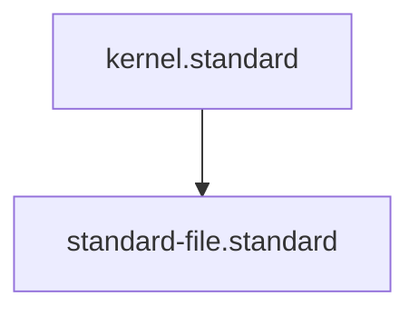

# Standard File Standard

## Context
A Standard is a "Contract." It defines the verifiable requirements that constitute a "Pass" for a specific engineering or governance domain. Standards are abstract and rule-based; they do not define system topology.

## Mandatory Sections
1. **Context**: Background and rationale for the standard.
2. **PADU Table**: The practice/rating enforcement matrix (5-column format).
3. **Enforcement**: Summary of how the standard is audited.

## PADU Table

| Practice | Rating | Rationale | Enforcement | Exception |
|---|---|---|---|---|
| Define `requirements: []` | **P** | Enables deterministic, code-backed auditing. | `standard_auditor.py` | None |
| Include **Enforcement** column | **P** | Ensures standards are actionable. | `doc-audit.skill` | None |
| Include **Architecture** section | **U** | Architecture belongs in Capabilities/Modules, not Standards. | `master_healer.py` | None |

## Rationale
Standards should remain pure definitions of quality and compliance. Mixing topology (Architecture) with rules (Standards) creates structural noise and violates the Principle of Single Responsibility.

## Enforcement
The posture is **Automated**. The `standard_auditor.py` script verifies that no standard contains an Architecture section.

## Architecture

