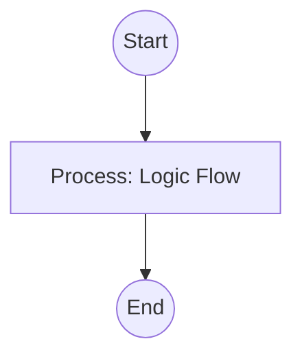

# Standard File Standard

## Context
This meta-standard defines the structural and hierarchical requirements for all files in the `standards/` directory. It ensures that standards are part of a tiered governance system with explicit abstracts, inheritance chains, and clear enforcement mechanisms for every quality rule.

## Architecture

## PADU Table Requirements
All standards must include a PADU table with the following columns:
1. **Practice**: The specific action or pattern being rated.
2. **Rating**: The P, A, D, or U score.
3. **Rationale**: Why this rating was assigned.
4. **Enforcement**: How violations are detected (Skill, Script, or Agent Audit).
5. **Exception**: Scenarios where the rating does not apply.

## PADU Table

| Practice | Rating | Rationale | Enforcement | Exception |
|---|---|---|---|---|
| Include concise **Abstract** | **P** | Provides immediate context. | `audit-frontmatter-completeness.skill` | None |
| Include **Enforcement** column | **P** | Ensures standards are actionable and auditable. | `evaluate-against-standard.skill` | None |
| Include **Enforcement** section | **P** | Summarizes the audit posture and quality debt. | Agent Audit (Auditor) | None |
| Define `parent_standard` | **P** | Establishes the hierarchy chain. | `verify-repository-integrity.instruction` | Root-level. |
| Actionable Enforcement | **P** | Every practice must have a verifiable detection method. | `evaluate-against-standard.skill` | None |
| Purely Subjective Standards | **D** | Standards without automated triggers lead to quality drift. | `standards-auditor.agent` | None |
| Use `version` field | **U** | Administrative bloat; use content hashes for internal tracking. | `check-id-uniqueness.skill` | None |
| Use `created/updated` fields | **U** | Administrative bloat; use Git/Filesystem metadata. | `check-id-uniqueness.skill` | None |
| Vague practice descriptions | **U** | Prevents objective evaluation. | Agent Audit (Auditor) | None |

Standards without enforcement are merely suggestions. By mandating an Enforcement column and section, we force the architect to think about how a rule will be caught by the system, moving the repository toward automated quality assurance.

## Enforcement
The Enforcement posture for this standard is currently **Agent-Audited**. While we have skills to check for the presence of the PADU table and frontmatter fields, verifying the "quality" of the rationales or the "validity" of an exception requires the **Standards Auditor** to perform a semantic review.

### Gaps
#### Subjective Rationale Evaluation
**Risk**: If rationales are weak or circular (e.g., "P because it is preferred"), the standard provides no actual guidance.
**Be Wary Of**: Agents blindly following a standard without understanding the underlying technical trade-offs.

#### Exception Over-use
**Risk**: If "None" is not strictly followed or if exceptions are too broad, the standard becomes toothless.
**Be Wary Of**: Using exceptions to bypass architectural constraints like atomicity.
